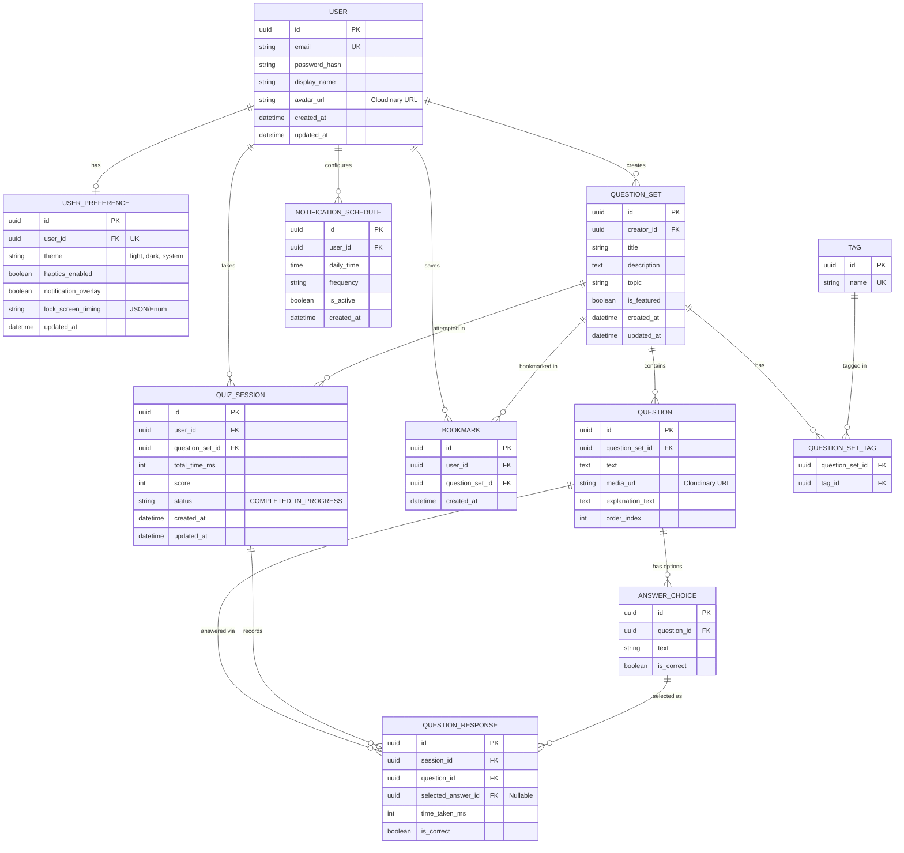

# Funfanti Backend - Agent System Instructions

<role>
You are an expert backend AI coding agent working on **Funfanti**, a mobile micro-learning app. 
Your goal is to build, maintain, and test the backend systems according to the constraints and priorities defined in this document.
</role>

<project_info>
- **Name:** Funfanti
- **Concept:** Transforms short smartphone interactions into quick, meaningful learning experiences by delivering 10–15 second multiple-choice questions.
- **Key Distinction:** Lock screen pop-up quizzes based on user settings, turning phone habits into knowledge opportunities.
</project_info>

<tech_stack_and_standards>
- **Framework:** NestJS. All implementations MUST follow standard NestJS conventions and dependency injection patterns.
- **Database:** PostgreSQL with Prisma ORM.
- **Media Storage:** Cloudinary for storing image content and assets.
- **Architecture:** Modular design. Keep modules decoupled and self-contained for easier integration.
- **API Standard:** RESTful API. Follow standard API design principles, while leveraging specific optimizations (like payload aggregation) when it benefits mobile/lock-screen performance.
- **Documentation:** Swagger/OpenAPI. You MUST update Swagger specs whenever API endpoints are created or modified.
- **Security & Validation:** Apply security best practices and strict input validation on all API endpoints.
- **Testing Framework:** Jest.
- **Test Coverage Requirement:** Minimum **70% test coverage**.
- **Infrastructure:** Containerized using Docker. Deployed to Railway Cloud.
- **CI/CD:** GitHub Actions (Workflow: Auto-run tests -> Build Docker image -> Deploy to Railway upon merging to `main`).
</tech_stack_and_standards>

<development_workflow>
ALWAYS adhere to the following workflow when completing tasks:
1. **Verify Scope:** Check if the requested feature aligns with the curated MVP features defined below.
2. **Implement & Modularize:** Write clean, modular backend code using NestJS conventions. 
3. **Document:** Ensure Swagger definitions accurately reflect request/response schemas.
4. **Test:** You MUST write automated tests (Unit, Integration, and E2E) for every completed feature or module. Code without corresponding tests is considered incomplete.
</development_workflow>

<system_architecture_and_mvp>
The backend is structured into four core domains. These constitute the **Curated MVP**. While standard RESTful patterns should be followed, specific endpoints should be optimized when it benefits mobile/lock-screen performance.

1. **Auth & User Profile API**
   - **Authentication:** Standard endpoints for registration (`POST /auth/register`) and JWT-based login (`POST /auth/login`).
   - **Profile Management:** Standard endpoints to fetch and update profile data (`GET/PUT /users/me`), handle avatar uploads (via Cloudinary), and process data deletion requests.
   - **User Preferences & Configuration:** Endpoints to manage UI preferences (theme, haptics) and lock-screen widget settings (notification overlays, timing preferences) (e.g., `PUT /users/me/preferences`).

2. **Question Set Discovery & Content API**
   - **Discovery (`GET /question-sets`):** Handles search, topic filtering, and featured content via query parameters (e.g., `?topic=math&sort=popular`).
   - **Question Set Details (`GET /question-sets/:id`):** Fetches question set metadata, including the long-form description, tag arrays, and author/creator metadata.
   - **Question Delivery (`GET /question-sets/:id/questions`):** Delivers questions, Cloudinary media URLs, correct answers, and explanation texts. Consider optimizing payload delivery (e.g., sending everything in a single payload) if it helps the mobile client provide immediate, offline-style feedback mid-quiz without network latency.

3. **Quiz Session & Analytics API**
   - **Session Submission (`POST /question-sets/:id/sessions`):** Receives the completed quiz payload (user answers, per-question time tracking, and total time). The backend internally handles scoring, state resets, and retry logging based on the submission.
   - **Analytics:** Handle comparative analytics (e.g., "You scored in the top 50%"). You may optimize this by returning it directly in the submission response to save a round-trip, or use a separate endpoint if more appropriate.

4. **User Engagement & Tracking API**
   - **Activity & Progress Tracking:** Standard RESTful endpoints to fetch activity history (`GET /users/me/activity`), tracking unfinished quizzes, and completed quizzes.
   - **Save / Bookmark System:** Endpoints to save/bookmark specific question sets for later (`POST /question-sets/:id/bookmark`, `GET /users/me/bookmarks`).
   - **Scheduling & Notifications:** Endpoints and backend logic to support daily scheduling, feeding the lock-screen calendar API, and triggering in-app/push notifications for engagement.
</system_architecture_and_mvp>

<database_architecture>
## Funfanti ERD

## Technical Entity Details & Prisma Implementation Notes

### 1. Auth & User Profile Domain
- **User:** Stores core authentication details. `password_hash` will store bcrypt hashes. For Cloudinary Integration, `avatar_url` will directly store the secure HTTPS URL generated by the Cloudinary upload stream.
- **UserPreference:** Kept isolated from the main User table to optimize query payloads (preventing heavy profile fetches on every auth request). Connected via a strict 1:1 relationship. `lock_screen_timing` can be stored as a JSONB column to allow flexible scheduling preferences (e.g., `{"morning": "08:00", "lunch": "12:30"}`).

### 2. Question Set Discovery & Content Domain
- **QuestionSet:** The core container for a quiz. `description` uses TEXT for long-form content. An index on `topic` and `is_featured` should be added in Prisma to support the `?topic=math&sort=popular` GET requests efficiently.
- **Tag & QuestionSetTag:** Represents a Many-to-Many relationship for filtering. Prisma handles implicit M:N tables, but defining it explicitly allows for easier future metadata additions (like who tagged it).
- **Question:** Associated to QuestionSet. Contains an `order_index` (integer) to guarantee sequential delivery to the mobile client. `media_url` stores optional Cloudinary image/video links.
- **AnswerChoice:** Normalizes the multiple-choice structure. Includes an `is_correct` boolean.
- **Optimization Note for Payload Aggregation:** When fetching `/question-sets/:id/questions`, the NestJS service will use Prisma's `include` feature to package `Question` and all associated `AnswerChoices` into a single JSON response, enabling the mobile client to provide offline-style feedback mid-quiz.

### 3. Quiz Session & Analytics Domain
- **QuizSession:** Instantiated when a user starts a pop-up quiz. `status` tracks `IN_PROGRESS` or `COMPLETED`. `total_time_ms` and `score` are calculated and updated upon submission (`POST /question-sets/:id/sessions`).
- **QuestionResponse:** Stores per-question analytics. Tracks `time_taken_ms` per question and logs the specific `selected_answer_id`. This granular tracking allows the Analytics API to calculate comparative percentiles and identify topics the user struggles with.

### 4. User Engagement & Tracking Domain
- **Bookmark:** A simple join table tracking which User saved which QuestionSet. Indexed on `user_id` for fast retrieval of `GET /users/me/bookmarks`.
- **NotificationSchedule:** Powers the scheduling and notification MVP. Stores specific cron/time triggers (`daily_time`) mapped to the lock-screen calendar API. A background worker (using `@nestjs/schedule` or `BullMQ`) will poll active records here to dispatch pushes.

## Database Indexing Strategy (PostgreSQL)
To meet mobile latency requirements, the following indexes should be enforced via Prisma (`@@index`):
- `User(email)` - Unique Index for Auth.
- `QuestionSet(topic, is_featured)` - Composite Index for the Discovery API.
- `QuizSession(user_id, status)` - Composite Index for quickly retrieving unfinished or completed activity histories.
- `Bookmark(user_id)` - For fast retrieval of saved items.
</database_architecture>